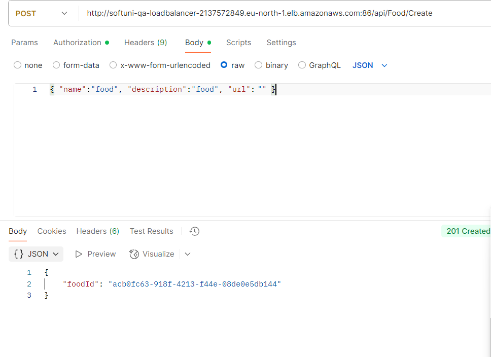
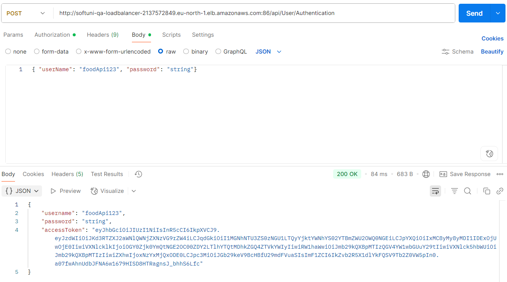

# 🚀 API Testing Portfolio: FoodieApp

This repository showcases practical skills in Web API testing, including request execution, response validation, and using Postman to create structured, runnable test collections.

---

## 📜 1. Description

This project consists of a Postman collection designed to test the core **CRUD** (Create, Read, Update, Delete) and **Auth** (Authentication) operations of the FoodieApp Web API. Key activities include:
* Testing HTTP methods: GET, POST, PUT, and DELETE.
* Validation of Status Codes and Response Data structure.
  

## 🔗 2. Deployment link

**Tested API:** FoodieApp API (Staging Environment).

## 💻 3. Technology Stack

* **Primary Tool:** **Postman** (used for API request creation, execution, and documentation).
* **Methodology:** API Functional Testing.
* **Protocol:** HTTP/HTTPS.
* **Artifact:** **`FoodieApp.postman_collection.json`**

## 📄 4. API Documentation

The complete API documentation, including request structures, validation tests, and the dependency chain between requests, is contained within the JSON collection file.

* **File Access:** The file **`FoodieApp.postman_collection.json`** is available in this repository. Please import it into Postman to review all content.

## 📐 5. Design Diagram

**Note:** For API testing, the "Design Diagram" often represents the Test Flow or Request Chain. Test flow followed the sequence: **Auth Request → Read/GET Request → Create/POST Request → Delete/DELETE Request.**

## 📸 6. Screenshots

Examples demonstrating successful execution and automated validation of the API tests:

### Successful GET Request

### Automated Validation Tests

### Successful GET Request

### Automated Validation Tests

